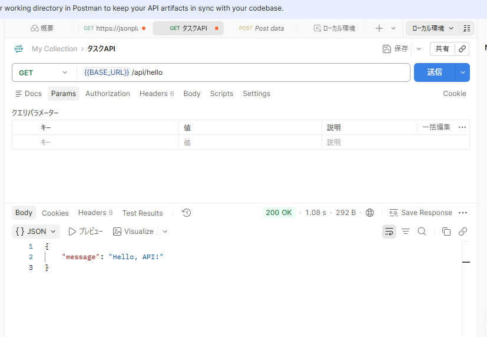

# api-setup-practice

## 概要

COACHTECH 教材 Tutorial 11-1「API開発環境の構築と疎通確認」で作成した成果物です。
ポストマンを使用して、GETリクエスト
「http://localhost/api/hello」で指定の記載が表示されることを確認

## 使用技術

- PHP 8.x
- Laravel 10.x
- REST API（JSONレスポンス）
- Postman（動作確認）

## 学んだこと

- ポストマンの初歩的な使用方法
-
-

## 動作確認

{{BASE_URL}/api/helloをポストマンに入力して確認
指定の記載とステータスコード200が表示されることを確認

